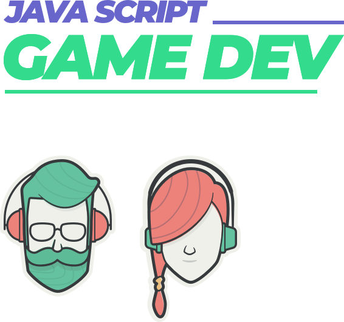

<h4 align="center">
    

</h4>


<p align="center">
  Imersão Game Dev :video_game:
  <br>
  <br>

  

  <a href="https://github.com/jlzimmerhansl/imersaoGameDev/commits/master">
    
  </a>

</p>

## :bookmark: Sobre o Projeto
A imersão Game Dev foi desenvolvida pela [Alura][url-alura], com o intuito de ensinar lógica de porgramação para a criação de um jogo em javascript.

## :wrench: Tecnologias

O objetivo da imersão, é utilizar somente javascript puro, a única ferramenta utilizada foi a bilioteca [p5js][url-p5js].

## :rocket: Como utilizar?

O projeto não possui dependências, assim, o jogo já funciona somente abrindo o arquivo `index.html`.

## :card_index: Como clonar:
 ```bash
 #Clonar repositório
 $ git clone https://github.com/jlzimmerhansl/imersaoGameDev.git
 ````

## :orange_book: Quem ministrou?
As aulas foram ministradas por [Juliana Nogueira][juliana], [Guilherme Lima][guilherme] e [Paulo Silveira][paulo].

---
<h4 align="center">
    Feito com :purple_heart: por <a href="www.linkedin.com/in/jessica-zimmerhansl" target="_blank">Jessica Zimmerhansl</a>
</h4>

[url-p5js]: https://p5js.org/
[url-alura]: https://www.alura.com.br/
[juliana]: https://twitter.com/juunegreiros
[guilherme]: https://twitter.com/guilhermebzlima
[paulo]: https://twitter.com/paulo_caelum   